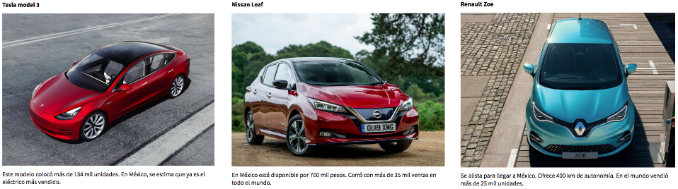

# ONECTA

## EL RETO

Nos contactó una empresa mexicana muy prestigiosa que busca crear la red de carga inteligente más grande y eficiente en México. El objetivo de este reto fue diseñar una aplicación móvil enfocada en los dueños de autos eléctricos, cuando tengan la necesidad de cargar su vehículo. 

## PREÁMBULO

La denominada “electromovilidad” cada vez genera más interés entre el público mexicano a causa de dos razones, principalmente. Una mayor conciencia ambiental y el progresivo aumento en los precios de los combustibles. La mejor manera de satisfacer a ambos intereses es con la compra de vehículos 100% eléctricos. 

Durante julio de 2019, el INEGI reportó que la venta de vehículos híbridos y eléctricos fue de 2, 068 unidades, 66.9% por arriba de lo registrado en el séptimo mes del 2018. Las ventas estuvieron compuestas por 12 eléctricos, 78 híbridos, conectables y 1,978 híbridos. En el acumulado enero-julio 2019 se comercializaron 12,408 vehículos con estos tipos de tecnologías, lo cual representaron el 1.66% de las ventas totales de vehículos ligeros en el país en los primeros siete meses del 2019.

## PROBLEMÁTICA

Para Tarak Mehta, presidente global de la división de electrificación de productos para la compañía ABB, uno de los grandes problemas es la infraestructura. “Para cruzar del sur al norte de México, 500 km de capacidad no es suficiente, necesitas un poco más, necesitas infraestructura”, agrega.

La Comisión Federal de Electricidad  ha instalado cerca de 900 puntos de carga en nuestro país. El problema es que se concentran mayoritariamente en zonas metropolitanas.

La autonomía y el miedo de los usuarios a quedarse sin batería en medio de la carretera, es algo que sigue pesando en la decisión de compra de un automóvil híbrido o eléctrico.

En México el Tesla modelo 3 colocó 134 mil unidades; se estima que ya es el eléctrico más vendido. Por otra parte el Nissan Leaf está disponible por 700 mil pesos en nuestro país. Cerró con más de 35 mil ventas en todo el mundo. Un auto eléctrico que se alista para llegar a México es el Renault Zoe con una autonomía de 400 km. En el mundo vendió más de 25 mil unidades.

## PROTO-PERSONA